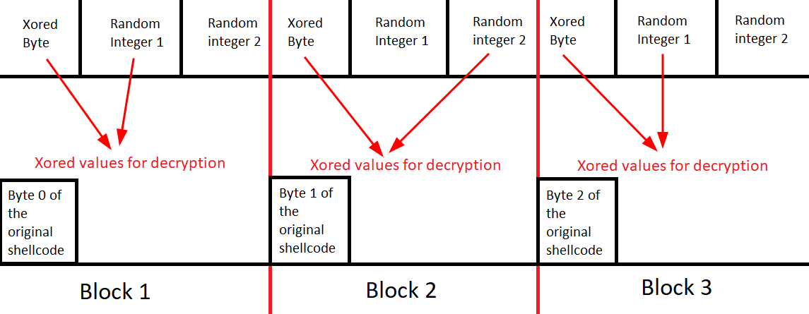

# Encoding-and-loading-shellcode-from-PNG
A POC to explain how to encode and load a shellcode from a PNG image

## Endoding method
The encoding method is done using a simple XOR. However, the bytes placement follows a pattern. The operation done by the Python script is the following:

1. I generate a first random integer with a value between 28 and 200.
2. I generate a second random integer with a value between 28 and 200.
3. I iterate the shellcode byte by byte, and I do the following operations depending of the byte possition:
    - If the current byte is on a even number possition, I XOR it with the first random integer generated before. 
    - If the current byte is on a odd number possition, I XOR it with the second random integer generated before.

4. Finally, I create a bytearray with the following structure:
    - First byte: The Xored byte
    - Second byte: The first random integer
    - Third byte: The second random integer

5. Now that we got the bytearray, we append it to the image, separating it from the original bytes of the image using '@@@@@@' in this case. We will use this string in the loader to search the possition of the shellcode.

## Loading Method

The loading method is just a 'decryption' of the shellcode written to the imagen. Now, we follow this steps:

1. We read the bytes of the modified image that contains the shellcode, and we save them to a vector
2. We iterate the vector searching for the ASCII value 64, that is equivalent to '@'
3. If we find a '@' (in ASCII, the value 64), we check if the following bytes match to the separator '@@@@@@' that we used in the Python script
4. If we find the pattern '@@@@@@', we save the start possition of the shellcode 
5. Now, having the starting possition of the shellcode, we iterate it with a 3-byte step and we start the decryption:
    -  If the current byte corresponds to an even number possition of the original shellcode (without encryption), we xor it  the value that is shifted by one position from the current byte and we save it to a buffer created before
    - If the current byte corresponds to an odd number possition of the original shellcode (without encryption), we xor it with the value that is shifted by two positions from the current byte and we save it to a buffer created before

6. Finally, we load the decrypted shellcode with the method of our choice

